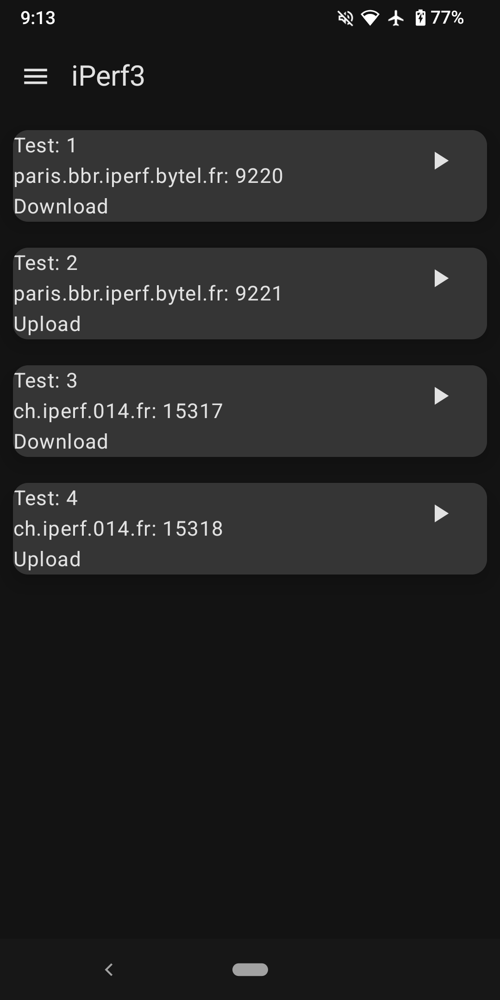

# iPerf3 Android client 
## What is iPerf3 ?

iPerf3 is a tool for active measurements of the maximum achievable bandwidth on IP networks. It supports tuning of various parameters related to timing, buffers and protocols (TCP, UDP, SCTP with IPv4 and IPv6). For each test it reports the bandwidth, loss, and other parameters.

For more information, see https://github.com/esnet/iperf, which also includes the iperf3 source code (note that this repository does not include any iperf3 source code).

## iPerf3 Android client

In general, the app is capable of:

- perform simple iperf3 upload and download tests

- Save preconfigured;

- Save test results and export them to the device;

- Graph transfer and bitrate;

This application does not share your personal data or geolocation, all work is offline.
The coarse and fine location permissions are used to give context to the measurments, data can be exported from the app for further analysis.
Location permissions are optional, iperf will still measure without them.

  
 
# Usage
Starting your own server:

```
$ iperf3 -s
-----------------------------------------------------------
Server listening on 5201 (test #1)
-----------------------------------------------------------
```

## On Android:


# Public iPerf3 servers

Servers iPerf3 servers will only allow one iPerf connection at a time. Multiple tests at the same time is not supported. If a test is in progress, the following message is displayed: "iperf3: error - the server is busy running a test. try again later"

The Android iPerf3 client app comes with 4 presaved servers configured



## Available at:

<p align="center">
  <a href="https://apt.izzysoft.de/packages/com.example.iperf3client">
    
  </a>
 <a href="https://f-droid.org/en/packages/com.example.iperf3client">
    
  </a>
  <a href="https://github.com/robinsrk/Flip_2_DND/releases/">
    
  </a>
   </br>
</p>

# Acknowledgments
- The main authors of [iPerf3](https://iperf.fr/) are (in alphabetical order): Jon Dugan, Seth Elliott, Bruce A. Mah, Jeff Poskanzer, Kaustubh Prabhu. Additional code contributions have come from (also in alphabetical order): Mark Ashley, Aaron Brown, Aeneas Jaißle, Susant Sahani, Bruce Simpson, Brian Tierney.

-  Khandker Mahmudur Rahman (mahmudur85) iPerf3 implementation for Android [iperf-jni](https://github.com/mahmudur85/iperf-jni)

# License

This program is Free Software: You can use, study share and improve it at your will. Specifically you can redistribute and/or modify it under the terms of the GNU General Public License as published by the Free Software Foundation, either version 3 of the License, or (at your option) any later version.
